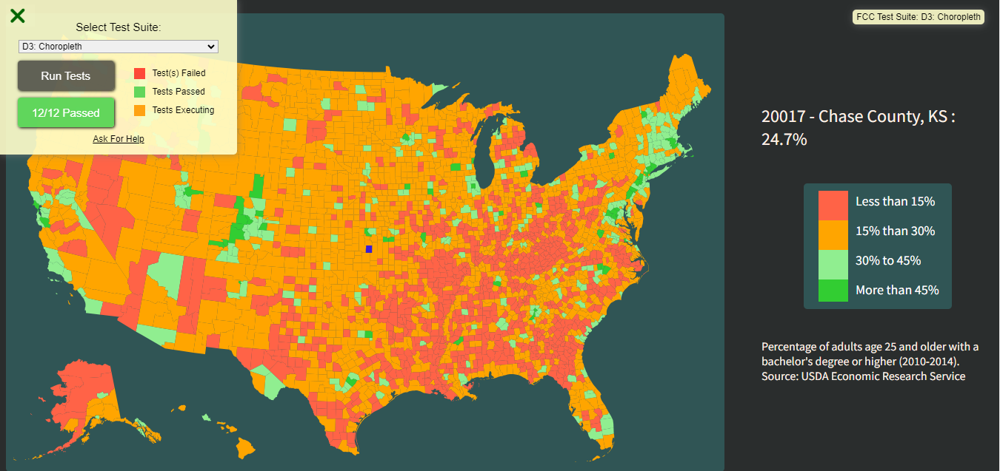

# Choropleth Map with D3.js

This project demonstrates how to create a choropleth map using D3.js, a powerful JavaScript library for data visualization. The choropleth map represents county-level education data in the United States.

## Preview

This is just an overview of the Chropleth Map

## Dependencies

To run the code, you need to have the following dependencies installed:

D3.js 

HTML file to embed the JavaScript code

## Usage

Clone the repository or download the JavaScript code file.

Open the HTML file in a web browser.

The map will be rendered on the webpage using the D3.js library.

Hover over a county on the map to view the education data tooltip.

The color of each county on the map represents the percentage of people with a bachelor's degree or higher. The color scale is as follows:

Red (tomato): <= 15%

Orange: <= 30%

Light green: <= 45%

Dark green (limegreen): > 45%

## Data Sources

The code uses two JSON data files as data sources:

counties.json: This file contains the geographical information of counties in the United States. 
It is used to draw the map boundaries.

for_user_education.json: This file contains education data for each county, including the percentage of people with a bachelor's degree or higher. It is used to determine the color of each county on the map.

## License

This project is licensed under the MIT License. You are free to use, modify, and distribute the code for both personal and commercial purposes. See the LICENSE file for more details.

## Credits

The code snippet in this project is based on a tutorial from FreeCodeCamp.

The data used in this project is provided by FreeCodeCamp as well.
